# Hangman Story Mode Game

## Overview

Welcome to the **Hangman Story Mode Game**, a unique take on the classic hangman game. This version introduces a story mode where users can create and play through custom stories, scenes, and levels. The game is designed to be fully customizable, allowing for a rich and immersive experience. All game states are stored in MongoDB, ensuring that progress is saved and can be accessed from anywhere, at any time.

## Features

- **Story Mode**: Create and play through custom stories with multiple scenes and levels.
- **Admin Portal**: Manage stories, scenes, and levels through a dedicated admin portal.
- **Image Assets Management**: Upload and manage game assets such as home page images, background images, and more.
- **Persistent Game State**: Game state is stored in MongoDB, allowing you to continue your game from any device.

## Getting Started

### Prerequisites

- **Node.js**: Ensure that you have Node.js installed on your machine.
- **MongoDB**: Make sure you have MongoDB set up either locally or using a cloud service like MongoDB Atlas.

### Installation

1. **Clone the repository**:
    ```bash
    git clone https://github.com/Subu114/HANGMAN-STORY-MODE.git
    ```
2. **Navigate to the project directory**:
    ```bash
    cd hangman-story-mode
    ```
3. **Install dependencies**:
    ```bash
    npm install
    ```
4. **Set up environment variables**:
    Create a `.env` file in the root directory with the following contents:

   For Backend:
    ```env
    PORT = YOUR_PORT
    DB_URL = MONGODB_URL
    JWT_SECRET = YOUR_JWT_SECRET_KEY
    SCENE_WORD_KEY = YOUR_SCENE_WORD_KEY(should be same)
    ```
    
   For Frontend:
    ```env
    VITE_SERVER_URL = BACKEND_SERVER_URL
    VITE_SCENE_WORD_KEY = YOUR_SCENE_WORD_KEY(should be same)
    VITE_USER_FOLDER = FODLER_NAME
    VITE_SCENE_FOLDER = FODLER_NAME
    VITE_GAME_FOLDER = FODLER_NAME
    ```
    
### Running the Application

1. **Start the NodeJS Server**:
    ```bash
    nodemon .
    ```
2. **Start the Front end Server**:
    ```bash
    npm run dev
    ```
3. **Access the game**:
    Open your browser and navigate to `http://localhost:3000` (The hosted port can be different so check in the terminal for the port).

## Admin Guide

### Initial Setup for Admin

1. **Register a new user** in the application.
2. **Change the user role to "admin"** in MongoDB:
    - Access your MongoDB collection.
    - Find the user document and update the `role` field to `admin`.
3. **Log in** with your admin credentials.
4. **Access the Admin Portal**:
    - After logging in, click `Continue` on the Menu page to be redirected to the Admin Portal.

### Admin Portal Features

- **Manage Levels**:
    - Create, edit, and delete levels.
- **Manage Scenes**:
    - Create, edit, and delete scenes.
- **Upload Game Assets**:
    - Upload images such as home page backgrounds and login portal backgrounds via the Game Img Upload button.

## User Guide

### Registration and Sign-In

1. **Register a new user**:
    - Navigate to the Register page.
    - Fill in the required details (note: the username must be unique).
    - Submit the registration form.

2. **Sign in with your credentials**:
    - Navigate to the Sign In page.
    - Enter your username and password.
    - Click Sign In to access the user portal.

### User Portal

- **View Stats**: On the user portal, you can view your game statistics.
- **Change Profile Picture**: Update your profile picture by clicking on the profile section.

### Playing the Game

1. **Click "Continue"** on the user portal to start the game.
2. **Pre-Scene Story**: The first screen will show the pre-scene story, setting the stage for the game.
3. **Scene Story**: Next, you’ll see the scene story, providing more context.
4. **Clue**: A clue will be presented to help you guess the word in the hangman game.
5. **Hangman Game**: Play the classic hangman game, guessing letters to complete the word.
6. **Win/Lose Page**: After the game, you’ll see a screen indicating whether you won or lost.
7. **Next Scene Page**: If there are more scenes, you’ll be directed to the next scene.
8. **Next Level Page**: If the current scene ends, you’ll move on to the next level.


## Screenshots

### User Pages
1. **Home**
   
   
3. **Sign In**

   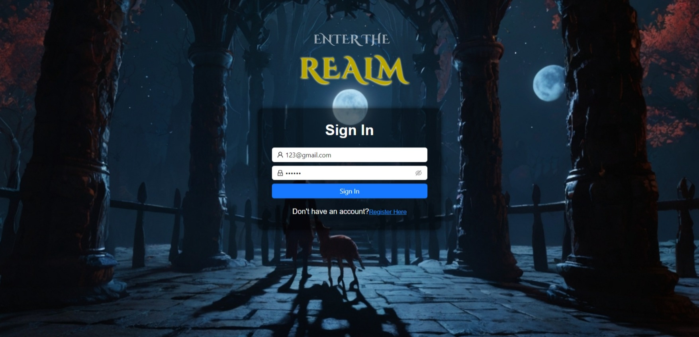
4. **Register**

   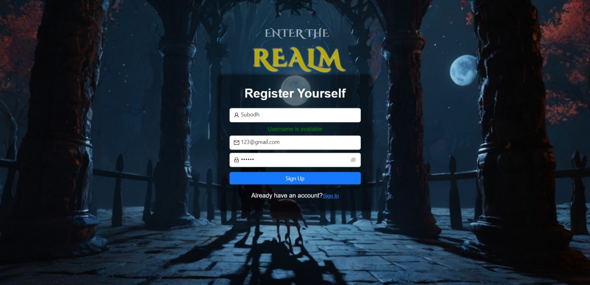
5. **Levels**

   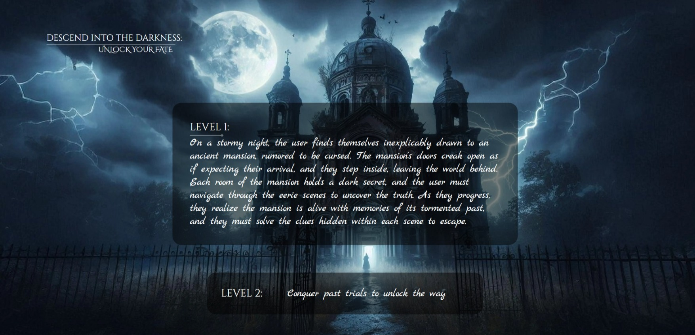
6. **User Portal (Menu)**

   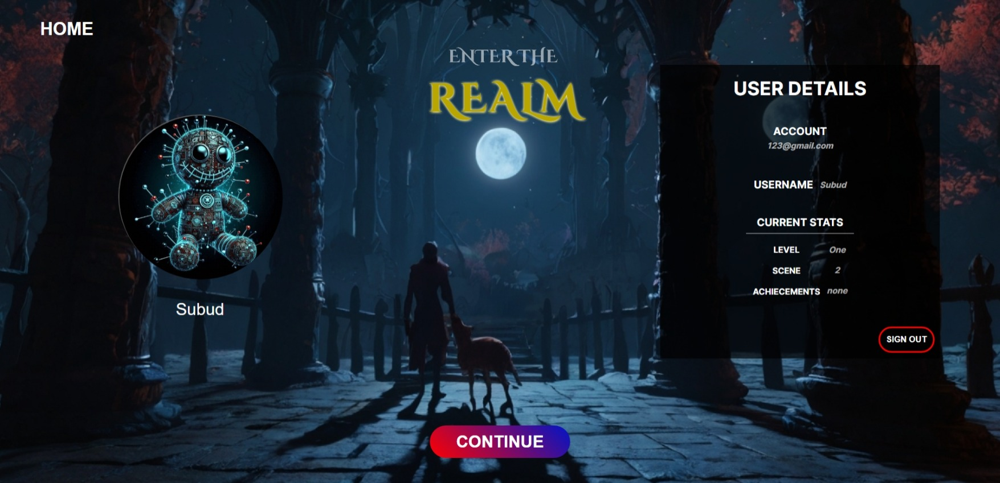
7. **Pre-Scene Story**

   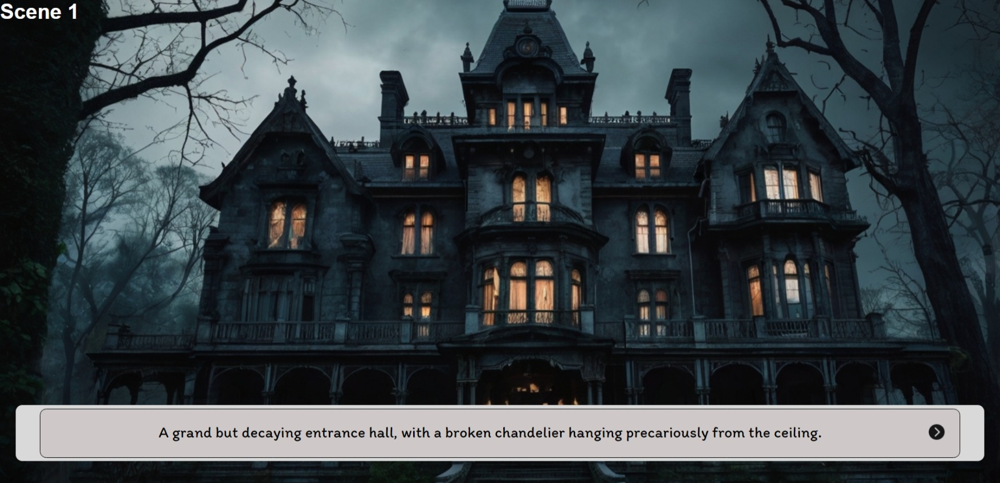
8. **Scene Story**

   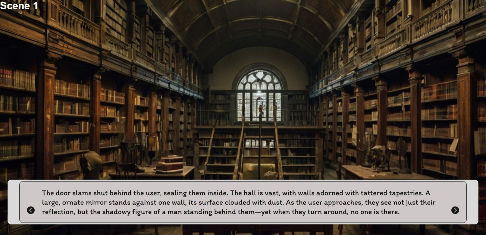
9. **Clue**

   
10. **Main Game Page**

   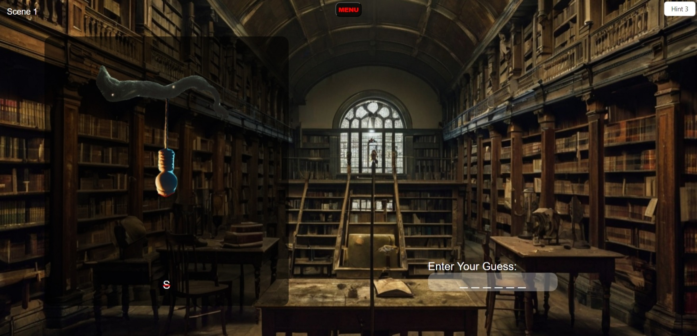
   

11. **Lost Page**

    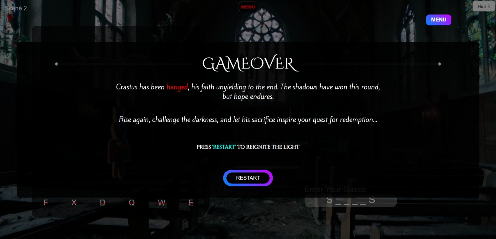
12. **Won Page**

    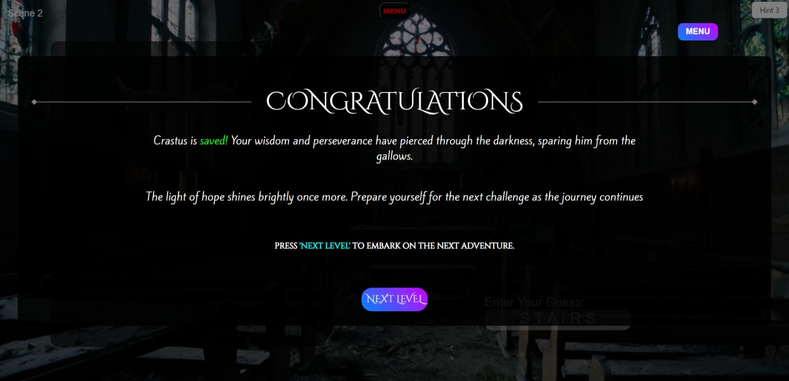

### Admin Pages
1. **Admin Main Page**
   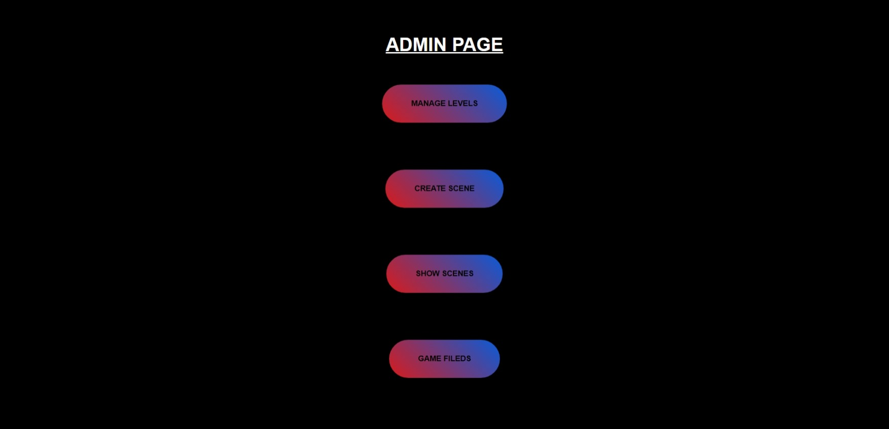

2. **Manage Levels**
   - **Show Levels**: 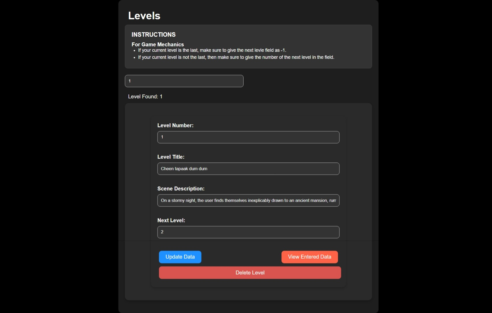

   - **Create Level**: 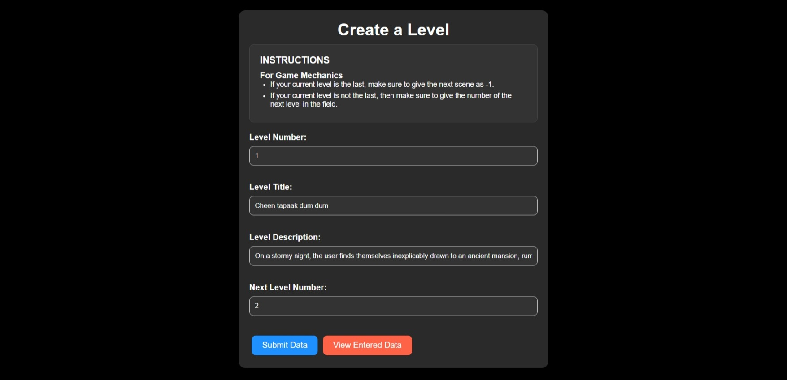

   - **Manage Levels**: 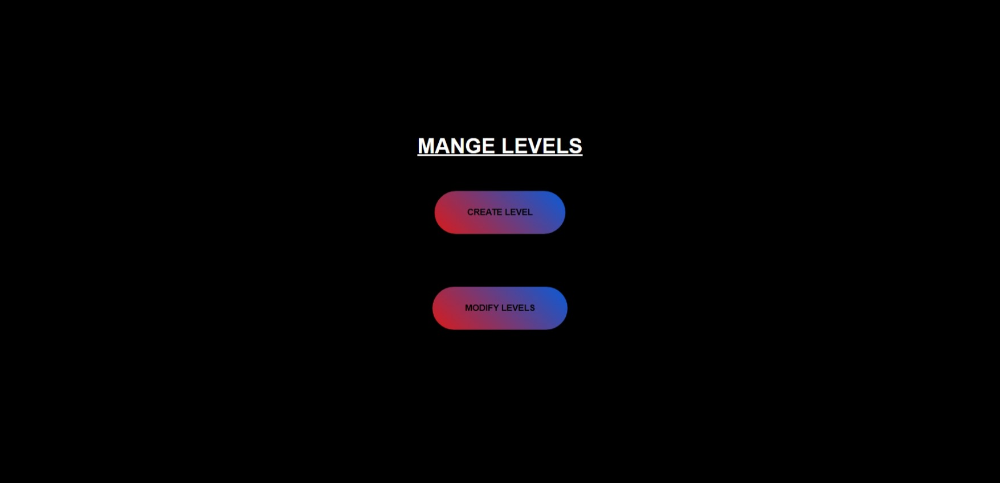

3. **Manage Scenes**
   - **Show Scenes**: 

   - **Add Scene**: 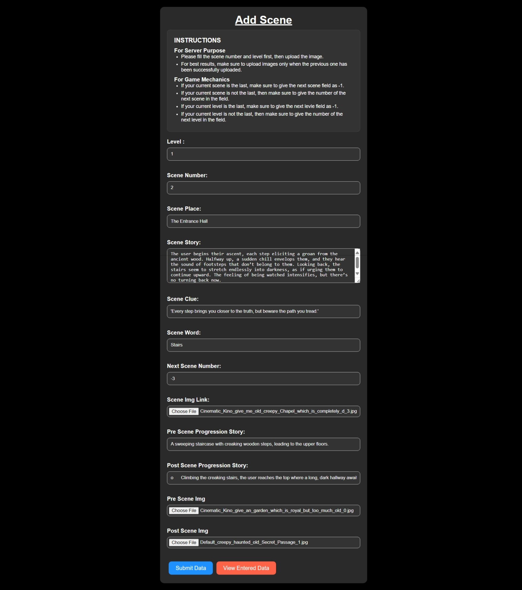

4. **Game Assets**

   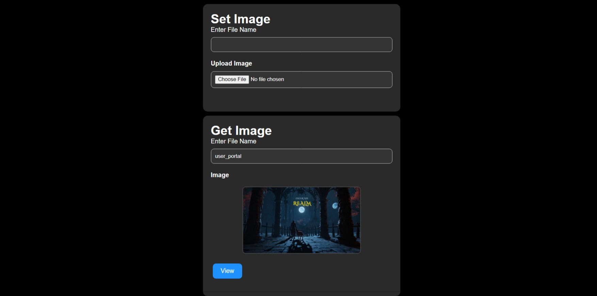


## Technologies Used

- **Frontend**: React
- **Backend**: Node.js, Express
- **Database**: MongoDB
- **Authentication**: JWT

## Contributing

Feel free to contribute to this project by submitting a pull request. Please ensure that your changes do not break existing functionality.

